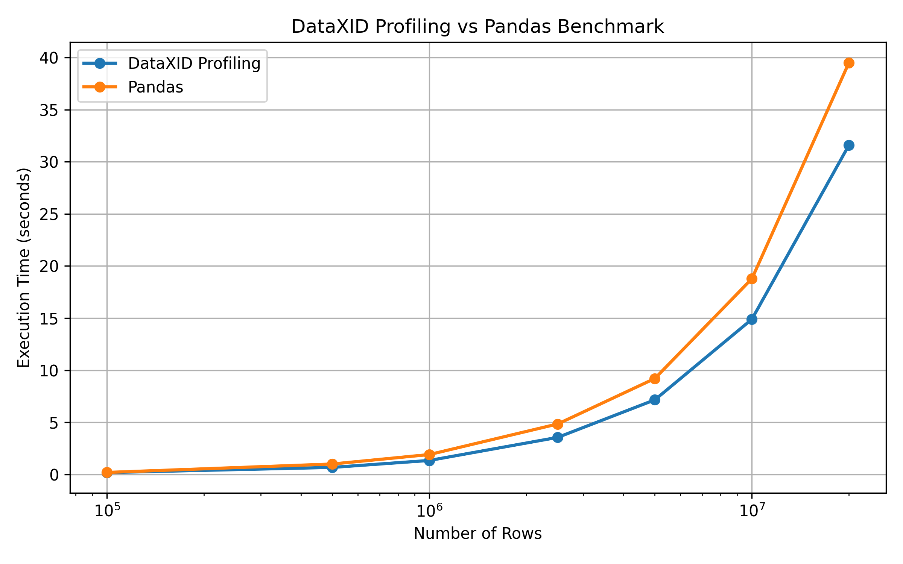

# DataXID Profiling Benchmarks

Benchmark studies for evaluating **DataXID Profiling** performance.

## Benchmarks

This repository contains comparisons between:

- DataXID Profiling vs Pandas
- DataXID Profiling vs YData Profiling

The provided benchmark scripts can be used to compare profiling performance by running the tests on different datasets.

## Dataset

Benchmark tests were performed using the Kaggle **Retail Sales Data** dataset (100,000 rows).

Source:
https://www.kaggle.com/datasets/noir1112/retail-sales-data

## Metrics

Measured metrics:

- Execution time
- Memory usage
- Profiling performance
- Scalability

## Result

DataXID Profiling vs Pandas:



## Installation

```bash
pip install -r requirements.txt
```

## Run

```bash
python benchmark_dataxid_vs_pandas.py
```

```bash
python benchmark_fgdata_profiling.py
```

## Technologies

- Python
- DataXID Profiling
- Pandas
- YData Profiling
