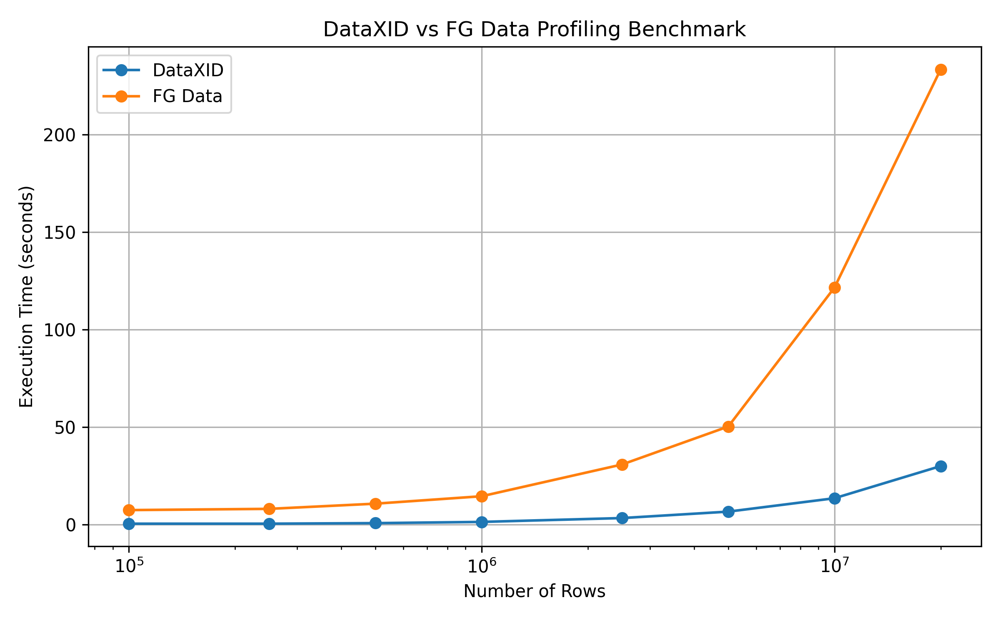

# DataXID Profiling Benchmarks
Benchmark studies for evaluating **DataXID Profiling** performance.
## Benchmarks
This repository contains comparisons between:
- DataXID Profiling vs YData Profiling (single-run, fixed-size dataset)
- DataXID Profiling vs YData Profiling (scaling benchmark, overview mode)
- DataXID Profiling vs YData Profiling (scaling benchmark, complete mode — correlations and interactions enabled on both sides)
> Note: "FG Data" in this repo refers to YData Profiling, a pandas-based profiling library.
 
There are two single-run scripts that profile a fixed dataset once and print
detailed stats (`benchmark_dataxid_profiling.py`, `benchmark_fgdata_profiling.py`),
and one scaling benchmark that runs both libraries across a range of dataset
sizes and produces a comparison plot (`benchmark_dataxid_vs_pandas.py`). The
scaling benchmark has been run in two configurations: overview mode (fast
path, correlations/interactions disabled on both sides) and complete mode
(all correlation types and interactions enabled on both sides, for an
apples-to-apples full-feature comparison).
## Dataset
Benchmark tests use the Kaggle **Retail Sales Data** dataset (`sales_20k.csv`) as a seed.
 
Source:
https://www.kaggle.com/datasets/noir1112/retail-sales-data
 
For the scaling benchmark, `dataset_generator.py` scales this seed dataset up
to the target row/column count (100,000 to 20,000,000 rows, 10 columns),
generating synthetic values based on the original columns' distributions.
The single-run scripts profile the seed dataset as-is.
## Metrics
Measured metrics:
- Execution time (profiling time and HTML report generation time, measured separately)
- Memory usage (RAM before/after profiling, single-run scripts only)
- Alert / correlation / interaction counts (disabled in the overview-mode run, enabled in the complete-mode run)
- Scalability across dataset sizes (scaling benchmark only)
## Result
DataXID Profiling vs YData Profiling, overview mode:


DataXID Profiling vs YData Profiling, complete mode (correlations and interactions enabled):

## Installation
```bash

pip install -r requirements.txt
```
## Run
Single-run profiling, fixed dataset:
```bash
python benchmark_dataxid_profiling.py
```
```bash
python benchmark_fgdata_profiling.py
```
Scaling benchmark across dataset sizes, with comparison plot:
```bash
python benchmark_dataxid_vs_pandas.py
```
## Technologies
- Python
- DataXID Profiling
- YData Profiling (FG Data)
